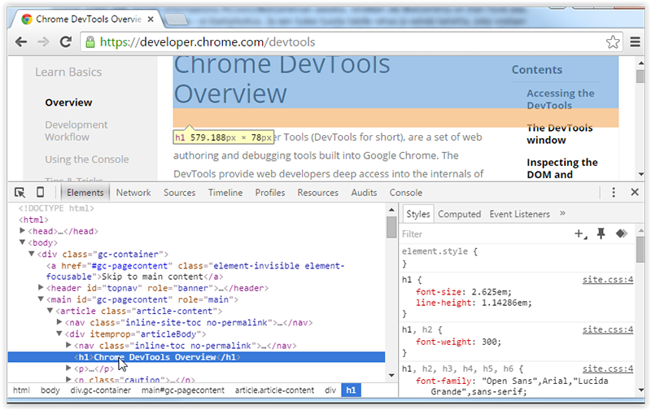

# Mediapalvelut ja käyttäjäkokemus, Angular Toolchain


## 1/2018

---

# Contents

- Editor/IDE: PhpStorm, Visual Studio Code, (or any)
- Language: TypeScript
- Run, test & debug: Chrome browser dev tools       
- Version Control System: Git
- Package manager: NPM
- Building & automating tasks: Angular CLI (webpack)
- Development frameworks: Angular, Bootstrap, Flexbox Grid, Foundation...

---

# Code editor or IDE

Ultimately, it's your choice. PhpStorm or VSCode are recommended.

#### WebStorm/PhpStorm
- free for Metropolia students. [Apply for license here](https://www.jetbrains.com/student/)
- quite ready out of the box. No need for plugins.

#### Visual Studio Code

- free & open source code editor by Microsoft (**!=** Visual Studio IDE)
- wide extension support
- lightweight, multiplatform support
- good [docs & instructions](https://code.visualstudio.com/docs/editor/codebasics)
- choice of many Angular developers

#### WebStorm

- [WebStorm](https://www.jetbrains.com/webstorm/)
  - free student license (only @metropolia.fi email address needed)
  - full featured IDE
  - based on IntelliJ IDEA, just like Android Studio

#### Other picks

- [Atom](https://atom.io/)
- [Brackets](http://brackets.io/)
- Other IDEs like: IntelliJ Ultimate IDEA, Eclipse, NetBeans... 

---

# Browser & debugging

- Chrome & [Chrome DevTools](https://developers.google.com/web/tools/chrome-devtools/)
- [Augury](https://augury.angular.io/) browser extension can be used for advanced debugging



---

# Package Management

## [NPM](https://www.npmjs.com/) - Node.js Package Manager

- Install [node.js](https://nodejs.org/en/) to get the package manager **npm**
- Use the LTS version
- npm packages needed in a project (dependencies) are listed in the `package.json` file and can be install with `npm install` command
- locally installed (=project specific) packages are downloaded to `node_modules/` folder (should be excluded from version control using .gitignore)

#### Alternative

[Yarn](https://yarnpkg.com/) 

- newcomer gaining a lot of traction now
- first [open source release on October, 2016](https://code.facebook.com/posts/1840075619545360). Current version 0.18.1 
- uses same package.json file and npm registry as npm
- claimed to be faster, more secure and reliable 

---

# Example package.json

```javascript
{
  "name": "example-app",
  "version": "0.0.1",
  "author": "Example Coder <ecoder@example.com>",
  "description": "An example app doing something",
  "license": "MIT",
  "scripts": {
    "start": "node ./app.js"
  },
  "dependencies": {
    "@angular/common": "~2.1.0",
    "@angular/core": "~2.1.0"
  }
}

```

---

# Automating Development Tasks

**[angular-cli](https://github.com/angular/angular-cli#angular-cli) command line tool** - `ng` command:

- Run frequent routine tasks in development workflow easily
- Create an app skeleton
- Generate app components 
- Run development server enviroment
- Run tests, validate code
- Build/Deploy application
  - Minify & combine source files
  - Remove comments & other extra stuff not needed in production version
- project specific settings in _angular-cli.json_ file

#### Other generic JS task runners (not needed in this course)

- [Grunt](http://gruntjs.com/) & Gruntfile.js (like make & makefile in C)
- [Gulp](http://gulpjs.com/) & Gulpfile.js 

---

# Frameworks used

## Front-end application logic

- [Angular](https://angular.io/)

## Layout/HTML/CSS

- [Bootstrap](http://getbootstrap.com/)
- [Flexbox Grid](http://flexboxgrid.com/)

---

# Source Code Management - Git

Check [Git stuff](https://github.com/mattpe/git-intro/blob/master/git-basics.md)

What files to include in repo?

- all source code
- README.md and other documentaion
- eg. settings files for npm, webpack etc.
- .gitignore file: list of local stuff not to be included in the version control.

Exclude:

- IDE specific project files & folders
- build targets and other automatically generated files
- packages managed e.g. by npm or bower (= _node_modules/_ & _bower_components/_ folders) 
- any temp & OS specific files, like Apple's `.DS_Store` 

---

# Getting Started with WebStorm

---

# Install WebStorm

Download & install [WebStorm](https://www.jetbrains.com/webstorm/)
        


---

# WebStorm settings
- [Accessing default settings](https://www.jetbrains.com/help/webstorm/accessing-default-settings.html)
- [Change JavaScript version to ES6](https://www.jetbrains.com/help/webstorm/javascript.html#ws_js_choose_language_version). Do this in (also) in default settings.
- [Enabling TSLint in a project](https://www.jetbrains.com/help/webstorm/tslint.html)

---

# Getting Started with VSCode

---
        
# Install the Editor

Download & install [Visual Studio Code](https://code.visualstudio.com/)
        


---

# Install Extensions

Press _ctrl-shift-x_ or click extensions icon on the left panel.

Search and install:

- Auto Import
- TSLint

Other handy extensions:

- EditorConfig for VS Code: support for [EditorConfig](http://editorconfig.org/)
- Duplicate file: Add _right-click -> Duplicate file_ action
    
---

# VSCode - Basic Usage

Active **project** is the folder open on the left side panel (_File -> Open folder..._) 

Handy keyboard shortcuts (finnish layout, check _File -> Preferences -> Keyboard shortcuts_ for more)        

- Multiline comment: _ctrl-'_
- Delete line: _ctrl-shift-k_
- Move line(s): _alt-up/down_
- Copy line(s): _alt-shift-up/down_
- Auto format code: _alt-shift-f_
- Open integrated console: _ctrl-ö_
- Quick find/open files: _ctrl-p_
- Split editor: _ctrl-§_

---

# VSCode - Settings

Change integrated console to Bash in Windows:

1. Install [Git for Windows](https://git-scm.com/downloads) to default location
2. Edit vscode settings file (_File -> Preferences -> User settings_) and add the following property into json object:

```js
// Place your settings in this file to overwrite the default settings
{
  "terminal.integrated.shell.windows": "C:\\Program Files\\Git\\bin\\bash.exe",
}
```

---

# Exercise 1: Setup your toolchain and a new Angular 2 project

**a.**

1. Install code editor (+ extensions), git, npm and angular-cli
2. Use angular-cli to generate the app skeleton ([set style type to _scss_](https://github.com/angular/angular-cli#global-styles)).
3. Test that app works, run with angular-cli and open in browser
4. Use link from Oma assignments to create a remote git repository and push your app there

**b.**

1. develop your app further. Add parts to the app skeleton so that the layout is similar to [this](https://cdn.tutsplus.com/net/uploads/legacy/397_yourFirstdesign/images/2.jpg)
2. git add, commit & push to remote repository 
3. goto b 1 and add content (text, images) and more CSS.

---

## Useful online material

Check [Readme file](https://github.com/mattpe/wbma) of this repo.
