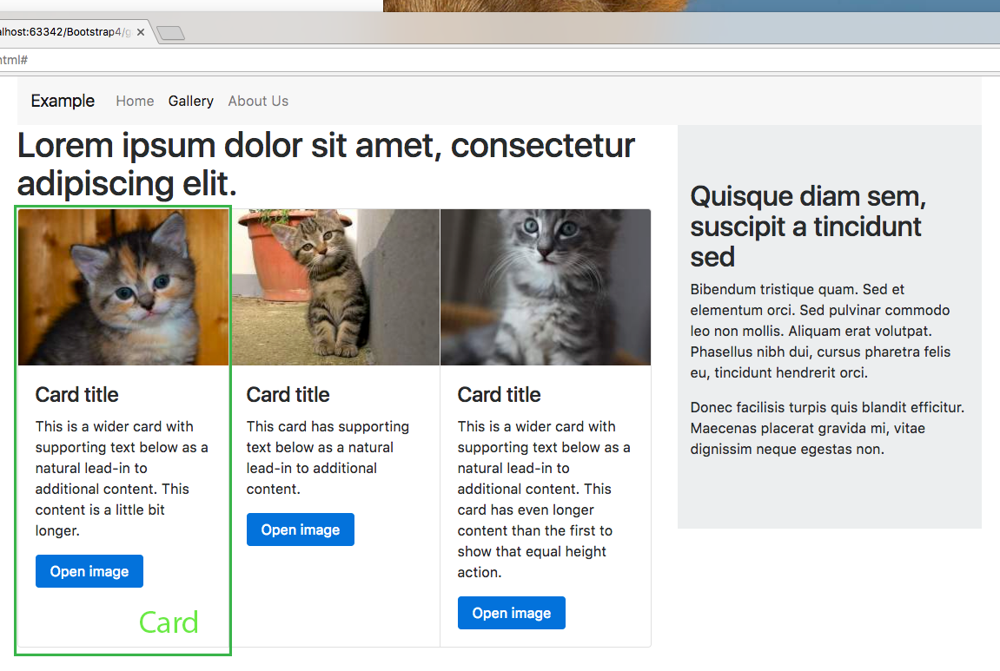

# Mediapalvelut ja käyttäjäkokemus, Bootstrap 4

## 1/2017

### Bootstrap task

1. Create a new valid HTML5 page
    - You can use [HTML5 boilerplate](http://www.initializr.com/). Download the classic version, no template, no jQuery, no Google analytics and no .htaccess
2. Add Bootstrap 4 alpha using the CDN links from the [Bootstrap 4 page](https://v4-alpha.getbootstrap.com/)
3. Copy index.html so that you have total of three html documents: index.html, gallery.html and about.html
4. Use Bootstrap to make the pages look like this:

index.html
    
___

gallery.html

___

about.html

